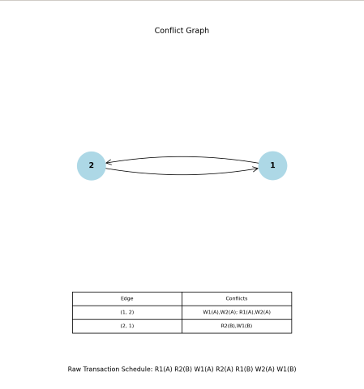
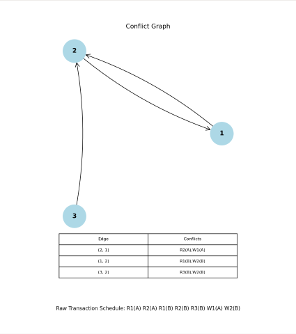
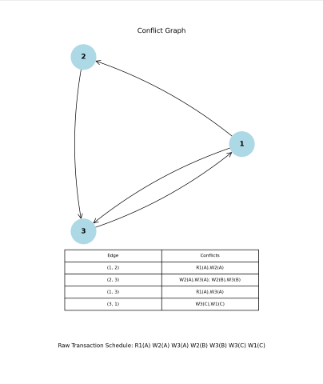

# Taransaction Schedule to Conflict Graph

A tool that given a transaction schedule, will generate a corresponding conflict-graph. The graph is rendered using [matplotlib](https://matplotlib.org/stable/index.html) and the underlying graph is created by [networkx](https://networkx.org/documentation/stable/reference/introduction.html)

## Prerequisites

Before you begin, ensure you have met the following requirements:
- You have a `Windows/Linux/Mac` machine.
- You have installed [Python](https://www.python.org/downloads/)

## Installation

To install the Conflict Graph Generator, follow these steps:

1. Clone the repo:
   ```bash
   [git clone https://github.com/yourusername/transaction-schedule-to-conflict-graph.git](https://github.com/Unobtainiumrock/transaction-schedule-to-conflict-graph.git)
   ```

2. Navigate to the cloned directory:
    ```bash
    cd transaction-schedule-to-conflict-graph
    ```

3. Install the required Python packages:
    ```bash
    pip install -r requirements.txt
    ```

## Usage

To use the Conflict Graph Generator, run the following commands in your terminal:

1. For the first example:
    ```bash
    python3 conflict-graph.py "R1(A) R2(B) W1(A) R2(A) R1(B) W2(A) W1(B)"
    ```

2. For the second example:
    ```bash
    python3 conflict-graph.py "R1(A) R2(A) R1(B) R2(B) R3(B) W1(A) W2(B)"
    ```

3. For the third example:
    ```bash
    python3 conflict-graph.py "R1(A) W2(A) W3(A) W2(B) W3(B) W3(C) W1(C)"
    ```

## Examples

Each example will generate a directed graph where:
- Each vertex represents a transaction
- Each edge represent where a conflict exists between tasks.

The edges will point from the earlier task to the latter task in a sequence of tasks with respect to time. Multiple conflicts per edge are represented by their labels, each separated by a semicolon `;`

### Example 1

After running:

    ```bash
    python3 conflict-graph.py "R1(A) R2(B) W1(A) R2(A) R1(B) W2(A) W1(B)"
    ```

You should expect to see the following outputs in your terminal:

```bash
Parsed schedule: [(1, 'R', 1, 'A'), (2, 'R', 2, 'B'), (3, 'W', 1, 'A'), (4, 'R', 2, 'A'), (5, 'R', 1, 'B'), (6, 'W', 2, 'A'), (7, 'W', 1, 'B')]
Conflict: ('W', 1, 'R', 2) Label: W1(A),R2(A)
Conflict: ('W', 1, 'W', 2) Label: W1(A),W2(A)
Conflict: ('R', 1, 'W', 2) Label: R1(A),W2(A)
Conflict: ('R', 2, 'W', 1) Label: R2(B),W1(B)
```

and the following image:



### Example 2

After running:

```bash
python3 conflict-graph.py "R1(A) R2(A) R1(B) R2(B) R3(B) W1(A) W2(B)"
```

You should expect to see the following outputs in your terminal:

```bash
Parsed schedule: [(1, 'R', 1, 'A'), (2, 'R', 2, 'A'), (3, 'R', 1, 'B'), (4, 'R', 2, 'B'), (5, 'R', 3, 'B'), (6, 'W', 1, 'A'), (7, 'W', 2, 'B')]
Conflict: ('R', 2, 'W', 1) Label: R2(A),W1(A)
Conflict: ('R', 1, 'W', 2) Label: R1(B),W2(B)
Conflict: ('R', 3, 'W', 2) Label: R3(B),W2(B)
```

and the following image:



### Example 3

After running:

```bash
python3 conflict-graph.py "R1(A) W2(A) W3(A) W2(B) W3(B) W3(C) W1(C)"
```

You should expect to see the following outputs in your terminal:

```bash
Parsed schedule: [(1, 'R', 1, 'A'), (2, 'W', 2, 'A'), (3, 'W', 3, 'A'), (4, 'W', 2, 'B'), (5, 'W', 3, 'B'), (6, 'W', 3, 'C'), (7, 'W', 1, 'C')]
Conflict: ('R', 1, 'W', 2) Label: R1(A),W2(A)
Conflict: ('W', 2, 'W', 3) Label: W2(A),W3(A)
Conflict: ('R', 1, 'W', 3) Label: R1(A),W3(A)
Conflict: ('W', 2, 'W', 3) Label: W2(B),W3(B)
Conflict: ('W', 3, 'W', 1) Label: W3(C),W1(C)
```

and the following image:


